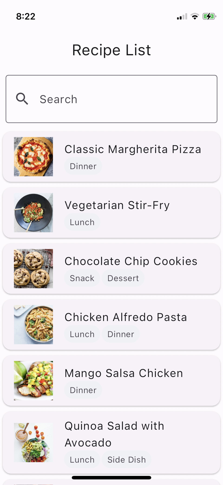
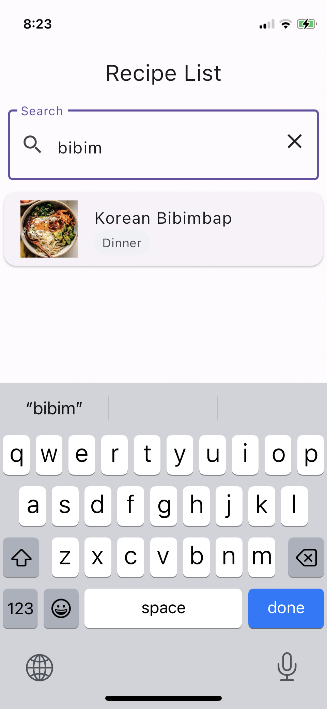
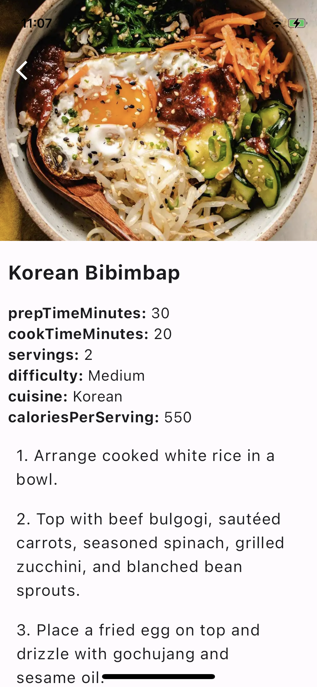
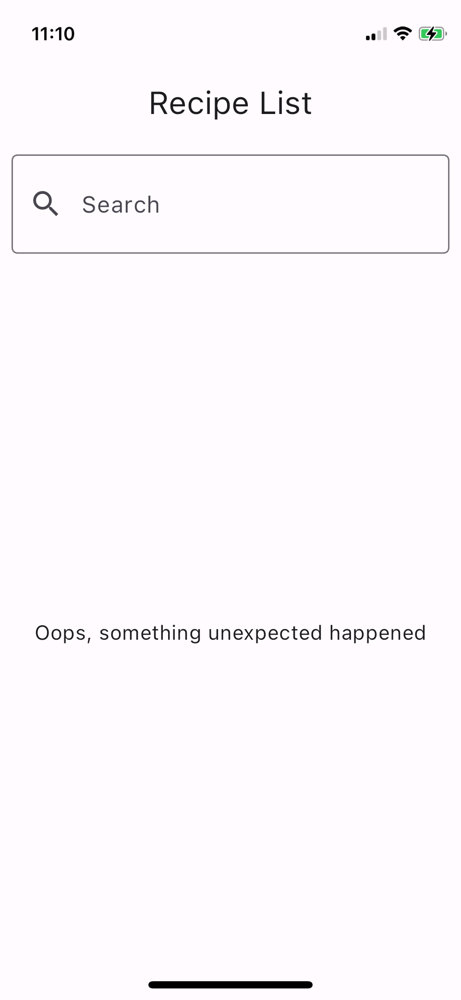
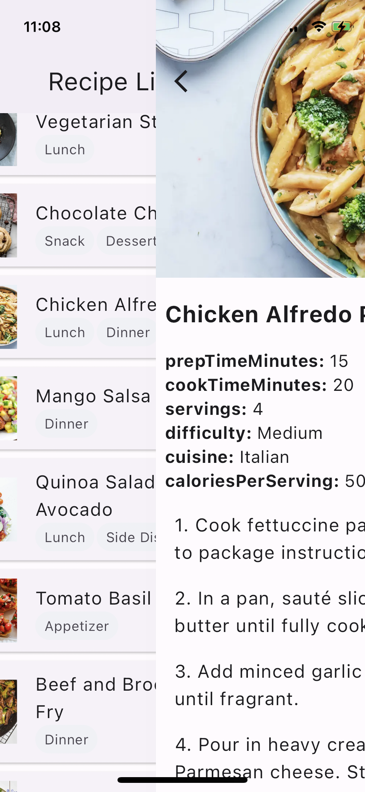

# Flutter Dish Discovery App

A Flutter application allows users to explore various dishes and recipes. 

## Screenshots
<p float="left">
    
    
    
    
    
</p>

## How to run
To run the app, you need to have Flutter installed on your machine. [Flutter Setup](https://docs.flutter.dev/get-started/install)
```
git clone https://github.com/betternormal/dish-discovery.git
cd dish-discovery
flutter pub get
flutter pub run build_runner build --delete-conflicting-outputs
flutter run
```
This project utilizes code generation packages such as Riverpod, freezed, and json_serializable.  
`g.dart`, `freezed.dart` files generated by these packages are included in the source code. Please do not manually edit these files, as they are automatically generated.    
if you want to modify the models, please modify the source files and run the following command to regenerate the files.  
```
flutter pub run build_runner watch 
```

## Features
- State management using Riverpod
- Route management using go_router
- Recipe list search with query param
- Recipe detail search with path param

## Built With
- [Flutter](https://flutter.dev/)
- [DummyJSON](https://dummyjson.com/)
  